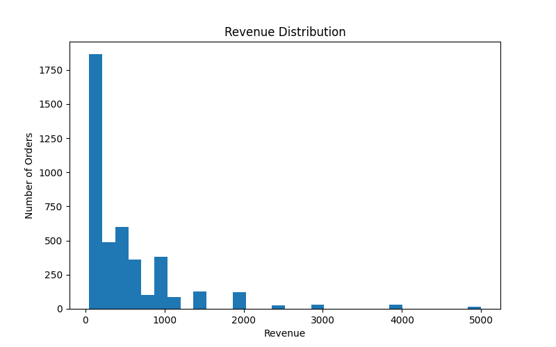
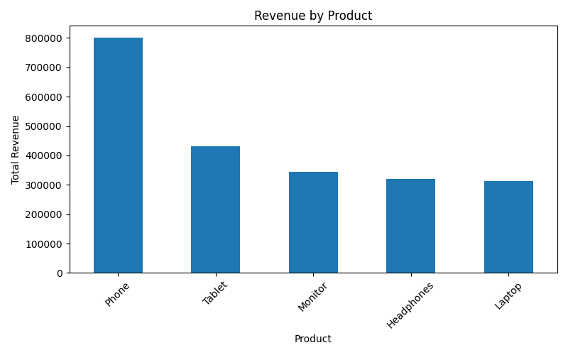

## Data Overview 

The dataset contains 5000 sales records with the following column:

- order_id - unique identifier of an order 
- order_date - date of the order 
- customer_id - unique identifier of a customer 
- product - product name 
- quantity - number of items sold
- price - price per item 

## Identified Data Quality Issues 

During the initial exploratory analysis, the following data quality issues were identified:

1. Missing values in the "price" column 
   - 280 records have missing price values.
   - These records cannot be used to calculate revenue.

2. Negative and zero value in the "quantity" column
   - Some records contain quantity equal to 0 or negatine values.
   - It is unclear whether these values represent returns or data errors.

3. Incorrect data types for "order_date"
   - The order_date column is stored as an object instead of a datetime type. 

## Business Impact 

Due to the identified data quality issues:

- Revenue calculations cannot be considered reliable.
- Missing prices lead to underestimation of total revenue.
- Negative quantities distort average sales metrics.
- Any conclusions based on the raw data may be misleading.

## Next Steps

Before performing any revenue analysis , the data must be cleaned and validated:

- Convert order_date to datetime format.
- Decide how to handle missing prices.
- Define business rules for negativeand zero quantities.
- Recalculate revenue after data cleaning.

### Sales Analysis (Clean Data)

This analysis is based on cleaned sales data from `data/processed/sales_cleaned.csv`.

The goal of this step is to analyze revenue distribution, identify top-performing products,
and evaluate key business metrics using validated data only.

### Visualization 

### Revenue Distribution

The revenue per order shows a right-skewed distribution.

Key observations:
- Most orders generate low to medium revenue.
- A small number of high-value orders create a long right tail.
- These high-value orders significantly affect the average order value.

### Revenue by Product

Revenue was aggregated by product to identify top contributors.

Key observations:
- "Phone" is the top revenue-generating product.
- Other products contribute at a comparable level.
- No product shows critically low performance.

### Key Metrics

- Average order value: 521.73
- Total number of orders: 4236

Due to the skewed distribution, the average order value is higher than the typical order.

### Business Insights

- Revenue is driven primarily by one leading product (Phone).
- High-value orders inflate the average order value.
- The product portfolio appears balanced overall.

## Business Conclusions

### Overall Sales Performance

The majority of orders generate relatively low revenue, while a small number of high-value orders significantly increase the overall revenue distribution.
The revenue distribution is strongly right-skewed, which indicates the presence of outliers with very high order values.

This means that most customers make small purchases, and large orders are rare but have a strong impact on aggregated metrics.

### Product Revenue Contribution

Among all products, "Phones" generate the highest total revenue and are the main driver of company sales.
Other products (Tablets, Monitors, Headphones, and Laptops) contribute noticeably less and have relatively similar revenue levels.

There are no products with zero or negligible revenue, which indicates that the product assortment is generally effective.

**Business risk:** the company is highly dependent on one product category, which may increase vulnerability to market changes.

### Average Order Value Analysis

The average order value is approximately 521, however this metric is significantly influenced by a small number of very expensive orders.
At the same time, the median order value is much lower, showing that at least half of the customers spend considerably less than the average.

This suggests that the mean order value overestimates typical customer behavior, and the median provides a more reliable measure for business decisions.

### Data Quality Impact on Business Metrics

During the analysis, several data quality issues were identified, including missing prices and invalid quantity values.
Without proper data cleaning, these issues would have led to distorted revenue calculations and misleading business conclusions.

This highlights the importance of data validation and cleaning before performing any financial or performance analysis.

### Recommendations

- Use median order value in addition to average metrics for more accurate insights.
- Reduce dependency on the Phone product category by strengthening other product lines.
- Investigate the root causes of missing prices and invalid quantities.
- Implement data validation rules at the data collection stage to prevent future quality issues.

### Final Note

This analysis demonstrates how raw transactional data can produce misleading results if data quality is not addressed.
After cleaning and validation, the dataset provides a reliable foundation for making informed business decisions.